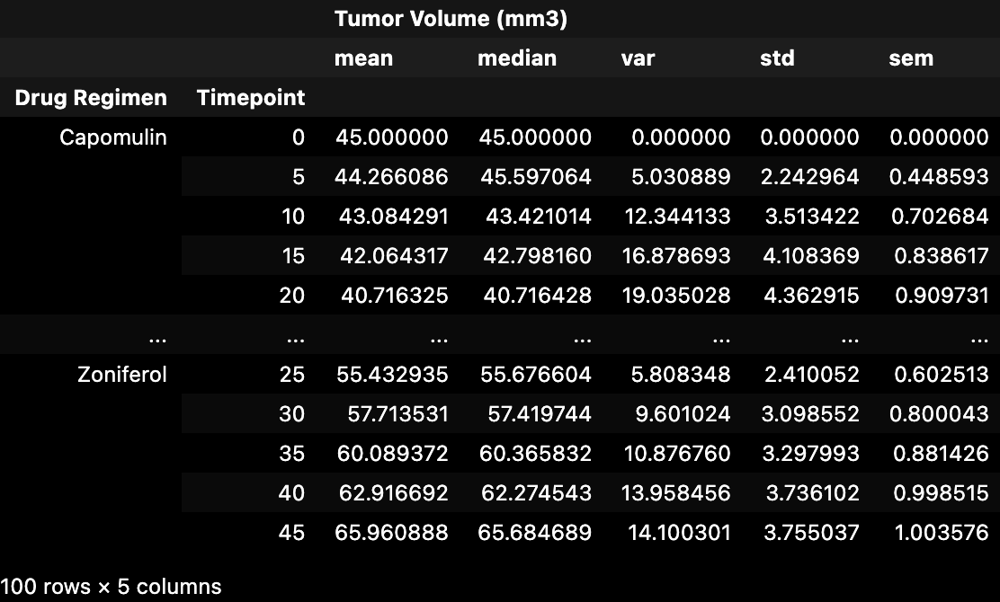
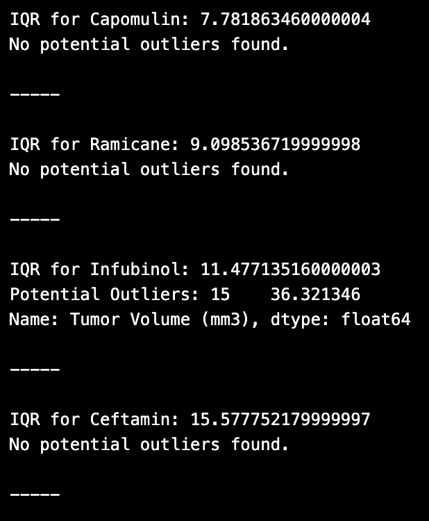
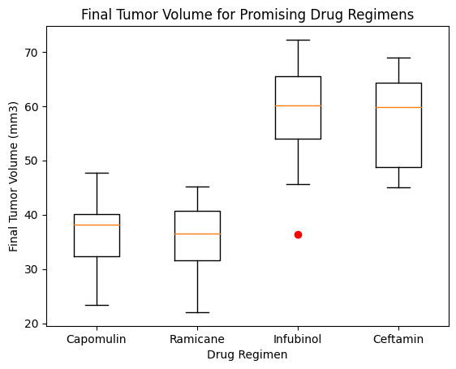
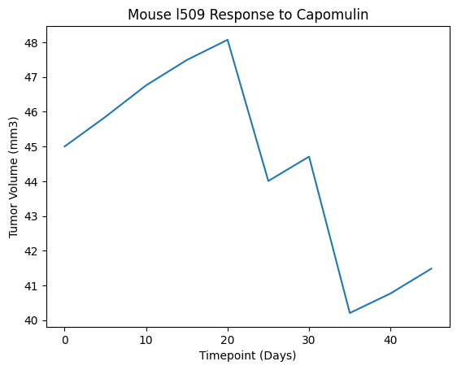
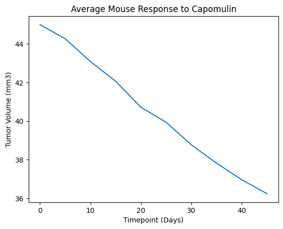
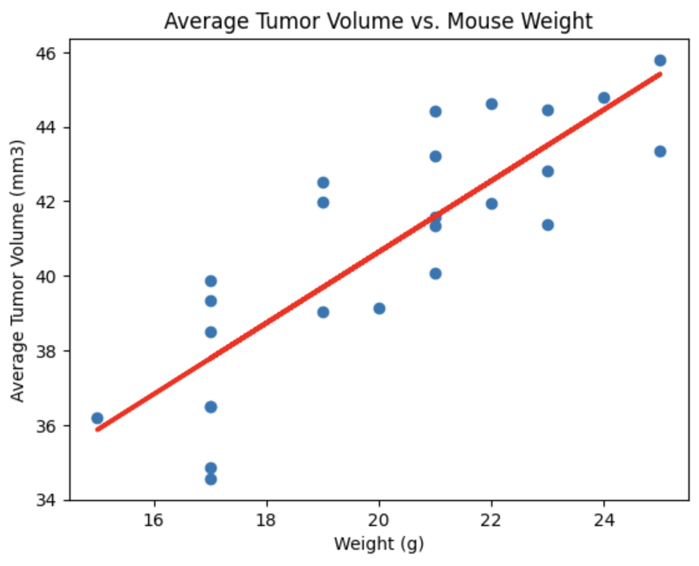

# pharmaceutical-eda
This analysis is an exploration of data provided by a theoretical pharmaceutical company specializing in anti-cancer medications. The firm recently began screening for potential treatments for squamous cell carcinoma (SCC). In this study, 249 mice with SCC tumors received a range of new drug regimens. Over the course of 45 days, tumor development was observed and measured. The purpose of this study was to compare the performance of Pymaceuticals’ drug of interest, Capomulin, against the other treatment regimens.

## Procedure

#### Prepare the Data
1. Run the provided package dependency and data imports, and then merge the `mouse_metadata` and `study_results` DataFrames into a single DataFrame.

2. Display the number of unique mice IDs in the data, and then check for any mouse ID with duplicate time points. Display the data associated with that mouse ID, and then create a new DataFrame where this data is removed. Use this cleaned DataFrame for the remaining steps.

3. Display the updated number of unique mice IDs.

#### Generate Summary Statistics
Create a DataFrame of summary statistics to include:
- A row for each drug regimen. These regimen names should be contained in the index column.
- A column for each of the following statistics: mean, median, variance, standard deviation, and SEM of the tumor volume.

#### Create Bar Charts and Pie Charts
1. Generate two bar charts. Both charts should be identical and show the total total number of rows (Mouse ID/Timepoints) for each drug regimen throughout the study.
    - Create the first bar chart with the Pandas `DataFrame.plot()` method.

    

    - Create the second bar chart with Matplotlib's `pyplot` methods.

    

2. Generate two pie charts. Both charts should be identical and show the distribution of female versus male mice in the study.
    - Create the first pie chart with the Pandas `DataFrame.plot()` method.

    

    - Create the second pie chart with Matplotlib's `pyplot` methods.

    

#### Calculate Quartiles, Find Outliers, and Create a Box Plot
1. Calculate the final tumor volume of each mouse across four of the most promising treatment regimens: Capomulin, Ramicane, Infubinol, and Ceftamin. Then, calculate the quartiles and IQR, and determine if there are any potential outliers across all four treatment regimens.
    - Create a grouped DataFrame that shows the last (greatest) time point for each mouse. Merge this grouped DataFrame with the original cleaned DataFrame.
    - Create a list that holds the treatment names as well as a second, empty list to hold the tumor volume data.
    - Loop through each drug in the treatment list, locating the rows in the merged DataFrame that correspond to each treatment. Append the resulting final tumor volumes for each drug to the empty list.
    - Determine outliers by using the upper and lower bounds, and then print the results.

2. Using Matplotlib, generate a box plot that shows the distribution of the final tumor volume for all the mice in each treatment group. Highlight any potential outliers in the plot by changing their color and style.

#### Create a Line Plot and a Scatter Plot
1. Select a single mouse that was treated with Capomulin, and generate a line plot of tumor volume versus time point for that mouse.

2. Generate a scatter plot of mouse weight versus average observed tumor volume for the entire Capomulin treatment regimen.

#### Calculate Correlation and Regression
1. Calculate the correlation coefficient and linear regression model between mouse weight and average observed tumor volume for the entire Capomulin treatment regimen.

2. Plot the linear regression model on top of the previous scatter plot.

